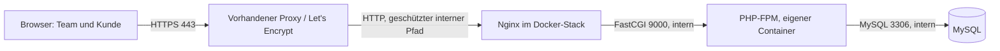

# Fachliches und technisches Konzept: IT-Zeiterfassung

Stand: 18.09.2026 · Version 2.0 · Frameworkfreie PHP-Anwendung mit drei Docker-Diensten

Grundlage: [Anforderungsanalyse, Version 1.3](Anforderungsanalyse.md). Dieses Konzept konkretisiert die Umsetzung. Es berücksichtigt die gemeinsame Teamansicht, lokale Benutzerkonten, administrative Rechtevergabe, Stundensätze und den lesenden Kundenzugang. Ein vorhandener vorgeschalteter Proxy übernimmt HTTPS und die Let's-Encrypt-Zertifikate. Die Webseite verwendet PHP, natives JavaScript, MySQL und Tailwind CSS; sie wird als kopierbares Dateipaket ohne Anwendungsframework ausgeliefert.

## 1. Empfohlene Lösung

**Drei Docker-Dienste: Nginx, PHP-FPM und MySQL.** Die Anwendung besteht aus gewöhnlichen PHP-Dateien, HTML-Vorlagen, nativem JavaScript und fertig erzeugtem Tailwind-CSS. Oberfläche, Benutzerverwaltung und Fachlogik gehören zu einem gemeinsam kopierbaren Projektordner.

| Baustein | Vorschlag | Zweck |
| --- | --- | --- |
| Betrieb | Linux-VM mit Docker Engine und Compose | Alle Anwendungsdienste laufen in Containern. |
| Vorgeschalteter Proxy | Vorhandene Infrastruktur | Öffentliches HTTPS und Let's Encrypt einschließlich Zertifikatserneuerung. |
| Webserver | Nginx im Anwendungsstack | Interner HTTP-Endpunkt, statische Dateien, Weiterleitung dynamischer Anfragen an PHP-FPM. |
| Anwendung | PHP 8.5 mit PHP-FPM in eigenem Container | Anmeldung, Berechtigungen, Zeiteinträge, Abrechnung und Export in überschaubaren PHP-Modulen. |
| Oberfläche | HTML, natives JavaScript und Tailwind CSS | PHP erzeugt die HTML-Seiten; JavaScript ergänzt Komfortfunktionen; Nginx liefert JavaScript und fertiges CSS aus. |
| Datenbank | MySQL 8.4 LTS mit InnoDB und utf8mb4 | Benutzer, Rechte, Zeiten, Sätze, Historie und Sitzungen. |
| Datenzugriff | PHP-PDO mit MySQL-Treiber | Parametrisierte SQL-Abfragen und Datenbanktransaktionen. |
| Rechteverwaltung | Zentrale PHP-Funktionen und MySQL-Tabellen | Rollen, Einzelrechte und fachliche Grenzen bei jeder Aktion prüfen. |
| Sicherung | MySQL-eigene Exportwerkzeuge und vorhandene Betriebsautomatisierung | Regelmäßiger Export aus dem MySQL-Container und externe Sicherung; kein zusätzlicher Anwendungsdienst. |

Die Zielumgebung ist PHP 8.5 mit aktiviertem `pdo_mysql` und den vorgesehenen nativen Passwort- und Sitzungsfunktionen. Diese Fähigkeiten werden im bereitgestellten PHP-Container mitgeliefert und beim Start geprüft. Auf dem Zielhost werden außer Docker und Compose keine PHP-Pakete oder Entwicklungswerkzeuge installiert. PDO_MYSQL ist der PHP-Treiber für den MySQL-Zugriff. [PHP PDO_MYSQL](https://www.php.net/pdo-mysql).

**Tailwind ohne Installation auf dem Webserver:** Eine fertige lokale Datei `public/assets/css/app.css` wird zusammen mit der Webseite ausgeliefert. Zur Entwicklung kann die eigenständige Tailwind-CLI die Datei erzeugen; dafür ist auch keine Node.js-Installation erforderlich. Erst wenn neue Tailwind-Klassen hinzukommen, wird die CSS-Datei während der Entwicklung neu erzeugt und erneut mitkopiert. Der Produktivstart führt keinen CSS-Build aus. [Tailwind CLI](https://tailwindcss.com/docs/installation/tailwind-cli).

JavaScript wird direkt als Browserdatei ausgeliefert. Externe JavaScript-Bibliotheken, Composer, npm und ein Framework-Installationsschritt sind nicht Teil der Anwendung. Alle Oberflächendateien liegen lokal vor; der Tailwind Play CDN wird nicht verwendet, da er für Entwicklung vorgesehen ist. [Tailwind Play CDN](https://tailwindcss.com/docs/installation/play-cdn).

MySQL 8.4 wird als LTS-Basis eingeplant. Die LTS-Linie hält ihren Funktionsumfang innerhalb der Serie stabil. Für die benötigten relationalen Daten ist sie geeignet. Beim Umsetzungsstart werden aktuelle Patchstände geprüft und reproduzierbar festgeschrieben. [MySQL-Veröffentlichungsmodell](https://dev.mysql.com/doc/refman/8.4/en/mysql-releases.html).

Die Technologieauswahl ist damit festgelegt. Anmeldung, Rechteprüfung, CSRF-Schutz und Datenzugriff werden als gemeinsame PHP-Module umgesetzt und gezielt getestet. Der Funktionsumfang der Anforderungsanalyse bleibt erhalten.

## 2. Aufbau der Docker-Umgebung



Der Anwendungsstack besteht aus genau drei dauerhaft laufenden Diensten: `nginx`, `php` und `mysql`. Der vorhandene Proxy übernimmt HTTPS und Zertifikatserneuerung. Sicherungen werden durch die vorhandene Betriebsautomatisierung ausgelöst; dazu ist kein vierter dauerhafter Container erforderlich.

| Dienst | Zugriff und Daten |
| --- | --- |
| `nginx` | HTTP-Endpunkt für den vorhandenen Proxy, vorgeschlagen auf Containerport 8080. Ausschließlich vom Proxy erreichbar; keine direkte öffentliche Freigabe. Bindet nur das öffentliche Verzeichnis und seine Serverkonfiguration lesend ein. |
| `php` | Eigener PHP-FPM-Container; Port 9000 nur intern erreichbar. Bindet den vollständigen Anwendungscode lesend ein und besitzt einen getrennten schreibbaren Bereich für Sitzungen. |
| `mysql` | Eigener Datenbankcontainer, nur im Datenbanknetz erreichbar. Persistentes Datenvolume; Port 3306 wird nicht auf dem Host veröffentlicht. |

Es gibt ein Web-/PHP-Netz und ein davon getrenntes internes Datenbanknetz. `php` verbindet beide, `mysql` liegt ausschließlich im Datenbanknetz. Dienste werden per Compose-Servicename angesprochen. Läuft der vorhandene Proxy als Container auf demselben Host, erhält ausschließlich `nginx` zusätzlich Zugang zu dessen dediziertem Proxy-Netz; ein Host-Portmapping ist dann nicht nötig. Läuft der Proxy auf einem anderen Host, wird der HTTP-Port nur an die private Hostadresse gebunden und durch die Firewall auf die Proxy-Quelladresse begrenzt. [Docker Compose Networking](https://docs.docker.com/compose/how-tos/networking/).

Nginx liefert JavaScript, CSS und sonstige statische Dateien aus `public/` aus. Für dynamische Anfragen ruft er ausschließlich `public/index.php` im PHP-FPM-Container auf; das erzeugte HTML gelangt über Nginx zurück zum Browser. PHP wird im PHP-Container ausgeführt, JavaScript im Browser. Beide Container sehen `public/` unter demselben absoluten Containerpfad, damit die FastCGI-Dateizuordnung eindeutig ist. PHP-Dateien dürfen nie als Quelltext ausgeliefert werden. Konfiguration und interne Module liegen außerhalb des Webroots. [Nginx FastCGI](https://nginx.org/en/docs/http/ngx_http_fastcgi_module.html).

**Verbindungsweg und Weiterleitungen:** Der Browser verbindet sich per HTTPS mit dem vorhandenen Proxy. Dieser übernimmt die öffentliche HTTP-zu-HTTPS-Weiterleitung und leitet intern per HTTP an Nginx weiter. Der interne HTTP-Pfad setzt ein geschütztes Netz voraus; bei einer Verbindung über ein nicht vertrauenswürdiges Netz wird der Backendpfad durch einen Tunnel oder TLS geschützt. Ein eigener HTTPS-Redirect anhand des internen Nginx-Verbindungsschemas wird vermieden, damit keine Weiterleitungsschleifen entstehen.

**Proxy-Informationen:** Am äußeren Proxy werden vom Client mitgelieferte Weiterleitungsheader bereinigt. Der Proxy setzt für diesen Aufbau den geprüften öffentlichen Hostnamen, `X-Forwarded-Proto: https`, den öffentlichen Port 443 und die tatsächliche Clientadresse in `X-Forwarded-For`. Nginx reicht diese Werte an PHP-FPM weiter und überschreibt das externe HTTPS-Schema nicht mit seinem internen HTTP-Schema. Die ursprüngliche Proxy-Peeradresse bleibt für die Vertrauensprüfung erhalten. [Nginx-Headerweitergabe](https://nginx.org/en/docs/http/ngx_http_proxy_module.html#proxy_set_header).

Ein gemeinsames PHP-Modul wertet Forwarded-Header ausschließlich für explizit konfigurierte Proxy-Adressen aus. Die tatsächliche Peeradresse stammt aus dem von Nginx gesetzten FastCGI-Parameter `REMOTE_ADDR`; das Verhalten wird bei der Inbetriebnahme geprüft. Der öffentliche Hostname wird explizit zugelassen. Die Anwendungskonfiguration enthält eine feste externe HTTPS-Basisadresse für Links und Redirects; Sitzungscookies behalten `Secure`. Der übermittelte Hostname wird nicht ungeprüft zur Erzeugung von URLs verwendet. Die Clientadresse für Anmeldebegrenzungen wird ausschließlich aus der geprüften Proxykette ermittelt.

Alle Laufzeitkomponenten laufen in Docker. Hostbetriebssystem, Domain, DNS, Firewall und das externe Sicherungsziel bleiben notwendige Infrastruktur. Als vorläufige Auslegung für höchstens zehn gleichzeitig aktive Personen schlage ich 2 vCPU, 4 GB RAM und 30–40 GB SSD vor. Das ist ein Startwert, keine gemessene Mindestanforderung; Backups benötigen zusätzlichen Platz außerhalb des Hosts.

## 3. Oberfläche und tägliche Nutzung

**Zeit erfassen:** Die Startseite interner Benutzer zeigt das kleine Eingabeformular, die eigene Tagessumme und die letzten Einträge. Datum und Person sind vorbelegt. Dauer und kurze Tätigkeit genügen. Schnellauswahl: 15, 30, 60 Minuten; freie Eingabe bleibt möglich. „Abrechenbar“ ist voreingestellt und direkt umschaltbar. Ein Speichervorgang benötigt keinen zusätzlichen Dialog.

**Meine Zeiten:** Eigene Einträge mit Tages- und Monatssummen. Entwürfe können geändert und nach Bestätigung gelöscht werden. Freigegebene oder abgerechnete Einträge zeigen ihren Status und sind gegen normale Änderungen gesperrt.

**Teamübersicht:** Alle internen Benutzer sehen, wer wann was wie lange gearbeitet hat, einschließlich interner Entwürfe. Filter: Zeitraum, Person und Status. Auf dem Smartphone werden Einträge als gut lesbare Karten dargestellt; am Desktop als Tabelle. Geldspalten erscheinen nur mit entsprechender Berechtigung.

**Abrechnung:** Berechtigte Personen sehen Arbeitszeit, abrechenbare Zeit und Beträge getrennt. Sie prüfen Einträge, ergänzen fehlende Sätze, geben Leistungen frei und markieren bereits extern abgerechnete Positionen. Sammelaktionen zeigen vorab Anzahl und Gesamtbetrag.

**Kundenübersicht:** Eigene Startseite für den Kunden mit freigegebenen und abgerechneten Leistungen, Summen und CSV-Export. Der Kunde sieht dieselben freigegebenen Daten wie die interne Kundenberichtsvorschau. Entwürfe und interne Verwaltungsinformationen werden bereits in der Datenabfrage ausgeschlossen.

**Verwaltung:** Benutzer anlegen, deaktivieren und zurücksetzen; Rollen und Rechte vergeben; Stundensätze pflegen; Firmenangaben und fachliche Einstellungen bearbeiten. Jeder Bereich wird nur bei passender Berechtigung angeboten.

Alle gespeicherten Tätigkeitsbeschreibungen sind im Team sichtbar und nach Freigabe auch beim Kunden. Es gibt zunächst kein zusätzliches Freitextfeld für geheime interne Notizen. Interne administrative Änderungsgründe werden separat gespeichert.

## 4. Lokale Anmeldung und Benutzerverwaltung

Die Anmeldung erfolgt mit **Benutzername und Passwort der Webseite**. Es besteht keine Abhängigkeit von Microsoft 365, Google oder einem externen Identitätsanbieter. E-Mail-Adressen sind optional, solange keine automatische Passwortwiederherstellung per E-Mail benötigt wird.

Vorgesehener Einrichtungsablauf:

1. Ein mitgeliefertes, interaktives PHP-Skript im PHP-Container legt den ersten Admin an, zum Beispiel über `docker compose exec php php bin/create-admin.php`. Das Skript ist nur über die Kommandozeile nutzbar und liegt außerhalb des Webroots. Es gibt keine öffentlichen Setupseiten oder fest eingebauten Standardpasswörter. Der Befehl beschreibt das geplante spätere Lieferpaket.
2. Der Admin legt weitere Konten mit Benutzername, Anzeigename, Kontotyp und Rolle an.
3. Die Anwendung erzeugt ein zufälliges, zeitlich begrenztes Initialpasswort, das einmalig angezeigt und nur als Hash gespeichert wird. Vorschlag für die Gültigkeit: 24 Stunden.
4. Beim ersten Login muss die Person ein eigenes Passwort setzen, bevor sie Anwendungsdaten öffnen kann.
5. Bei vergessenem Passwort erzeugt der Admin einen neuen Initialzugang. Bestehende Sitzungen werden widerrufen. Der bisherige Passwortwert ist für den Admin nicht lesbar.

Die Anmeldung wird mit nativen PHP-Sitzungen umgesetzt. `session_start()` öffnet die serverseitige Sitzung; nach erfolgreicher Anmeldung wird die Sitzungskennung erneuert. Ein gemeinsamer Anmeldeschutz prüft auf jeder geschützten Anfrage das aktive Konto, die Sitzungsversion und die aktuellen Rechte. Die Sitzung enthält keine dauerhaft verbindliche Kopie der Berechtigungen.

Passwörter werden mit `password_hash()` und Argon2id gehasht und über `password_verify()` geprüft. Das mitgelieferte PHP-Image muss Argon2id unterstützen; Parameter werden auf dem Zielserver geprüft. Loginfehler werden einheitlich formuliert; Versuchsbegrenzungen werden anhand von Benutzerkennung und geprüfter Clientadresse in MySQL geführt. [PHP password_hash](https://www.php.net/manual/en/function.password-hash.php).

Sitzungsdaten liegen in einem nur für PHP zugänglichen Volume außerhalb des Webroots. PHP akzeptiert Sitzungskennungen ausschließlich per Cookie und verwendet den strikten Sitzungsmodus. Cookies erhalten `Secure`, `HttpOnly` und `SameSite=Lax`. Die Anwendung prüft die achtstündige Inaktivitätsgrenze selbst; für kritische Konto- und Rechteänderungen wird das Passwort erneut verlangt. Bei Reset, Deaktivierung oder Kontotypwechsel wird die Kontositzungsversion erhöht, wodurch vorhandene Sitzungen mit der nächsten Anfrage ungültig werden. [PHP-Sitzungssicherheit](https://www.php.net/manual/en/session.security.ini.php).

Alle schreibenden Formulare und JavaScript-Anfragen benötigen ein zufälliges, sitzungsgebundenes CSRF-Token. Es wird mit `random_bytes()` erzeugt und über `hash_equals()` verglichen. HTML-Ausgaben werden kontextgerecht maskiert; Tätigkeitsbeschreibungen werden als Text behandelt. Datenbankwerte werden über PDO-Prepared-Statements gebunden, Sortierfelder und andere SQL-Bezeichner über feste erlaubte Listen ausgewählt. [PDO Prepared Statements](https://www.php.net/manual/en/pdo.prepare.php).

Eine Zwei-Faktor-Anmeldung bleibt eine gesondert zu entscheidende spätere Erweiterung. Sie ist keine Voraussetzung für das erste kopierbare Lieferpaket.

## 5. Rollen und Rechte

**Jedes aktive interne Teamkonto hat Leserechte auf alle Teamzeiten.** Zusätzliche Befugnisse werden vom Admin zugewiesen. Die Oberfläche bietet verständliche Rechtebezeichnungen und zeigt die resultierenden Rechte eines Kontos an.

| Aktion | Teammitglied | Abrechnungsverantwortliche | Admin | Kunde |
| --- | --- | --- | --- | --- |
| Teamtätigkeiten und Zeiten lesen | Ja, alle internen Status | Ja | Ja | Nur freigegeben/abgerechnet für seine Firma |
| Eigene Entwürfe anlegen und ändern | Ja | Ja | Ja | Nein |
| Fremde Entwürfe ändern | Nur mit Zusatzrecht | Standardmäßig ja | Ja | Nein |
| Interne Stundensätze und Beträge sehen | Nur mit Zusatzrecht | Ja | Ja | Nur Werte in seinem freigegebenen Bericht |
| Stundensätze pflegen | Nur mit Zusatzrecht | Standardmäßig ja | Ja | Nein |
| Freigeben und abrechnen | Nur mit Zusatzrecht | Ja | Ja | Nein |
| Korrektur abgerechneter Leistungen | Nur mit Zusatzrecht | Standardmäßig ja | Ja | Nein |
| Benutzer und Rechte verwalten | Nein | Nein | Ja | Nein |
| Berichte exportieren | Im eigenen Lesebereich | Im eigenen Lesebereich | Ja | Nur seinen Kundenbericht |

Vordefinierte Rollen dienen als Vorlagen. Der Admin darf weitere interne Rollen aus einem festen Berechtigungskatalog zusammenstellen und Zusatzrechte direkt zuweisen. Die Rechte ergeben sich aus der Vereinigung der Rollenrechte und Zusatzrechte. Zum Entzug eines Rechts müssen sämtliche Quellen entfernt werden; die Verwaltungsansicht zeigt diese Quellen. Individuelle Verbotsregeln werden zunächst nicht eingeführt.

Vorgesehene Zusatzrechte sind unter anderem `entries.manage_team`, `finance.view`, `rates.manage`, `entries.release`, `billing.finalize`, `billing.correct` und `audit.view`. Benutzer- und Rechteverwaltung bleiben der geschützten Adminrolle vorbehalten. Der Admin kann diese Rolle an weitere interne Personen vergeben.

Rollen und Zuweisungen werden in eigenen einfachen MySQL-Tabellen gespeichert. Zentrale PHP-Funktionen prüfen vor jeder Aktion Rolle beziehungsweise Einzelrecht sowie Person, Firma, Status und sichtbare Felder. Ein fehlendes Recht führt zur Ablehnung. Die Prüfung wird sowohl bei vollständigen Seitenaufrufen als auch bei Formularen, JavaScript-Endpunkten und Exporten angewendet.

Feste Grenzen gelten auch bei konfigurierbaren Rollen:

- Ein Kundenkonto ist auf den Kundenbereich seiner Firma begrenzt und kann keine internen Rollen erhalten. Diese Grenze wird vor allgemeinen Berechtigungsprüfungen durchgesetzt.
- Ein Admin kann abgerechnete Originaleinträge nicht beliebig überschreiben; auch für ihn gilt der dokumentierte Korrekturablauf.
- Interne Teamleserechte erlauben keinen Zugriff auf Passwortdaten, Sitzungen oder die administrative Historie.
- Geldwerte werden ohne Recht aus Serverantworten und Exporten entfernt. Versteckte Spalten allein genügen nicht.
- Der letzte aktive vollständige Admin kann nicht entfernt oder deaktiviert werden. Gleichzeitige Verwaltungsaktionen werden dabei gemeinsam abgesichert.
- Rechteänderungen wirken spätestens bei der nächsten Serveranfrage, auch bei bereits angemeldeten Konten. Rechte werden für jede Anfrage neu aus der Datenbank geladen und höchstens innerhalb dieser Anfrage zwischengespeichert.
- Bereits gelesene oder heruntergeladene Daten lassen sich durch einen späteren Rechteentzug nicht zurückholen.

## 6. Datenmodell

| Datenbereich | Wesentliche Inhalte |
| --- | --- |
| `users` | Benutzername, Anzeigename, Passwort-Hash, intern/Kunde, aktiv/deaktiviert, Firma bei Kundenkonten, erzwungener Passwortwechsel, Ablauf des Initialzugangs, Sitzungsversion. |
| Rechteverwaltung | `roles`, `permissions`, `role_permissions`, `user_roles` und `user_permissions` mit eindeutigen Zuordnungen. |
| `companies` | Zunächst genau eine externe Firma, Name, Währung und fachliche Einstellungen. |
| `hourly_rates` | Firma, optional Person, Gültig-ab, Gültig-bis, Cent pro Stunde, Änderungsmetadaten. Ohne Person handelt es sich um den Firmenstandardsatz. |
| `time_entries` | Kennung, Firma, Person, Leistungsdatum, Minuten, Tätigkeit, Abrechenbarkeit, verwendeter Satz, Betrag, Status, Versionsnummer und Erstellungs-/Änderungsdaten. |
| `billing_adjustments` | Referenz auf Originaleintrag, getrennte Zeit- und Betragsdifferenz, Status, kundenlesbare Erläuterung und interner Grund. |
| `audit_events` | Handlung, handelnde Person, Zielobjekt, Zeitpunkt, zulässige Vorher-/Nachherwerte und Änderungsgrund. Keine Passwortwerte oder Sitzungsschlüssel. |
| `submission_keys` | Eindeutiger Schlüssel je Benutzer und Speichervorgang, Anfragefingerabdruck und Ergebnisreferenz gegen doppelte Speicherung. |
| Betriebsdaten | `login_attempts` für begrenzte Anmeldeversuche und `schema_versions` für ausgeführte SQL-Änderungen. Native PHP-Sitzungen liegen separat im PHP-Volume. |

Wesentliche Datentypen: Leistungsdatum als `DATE`, Dauer als ganze Minuten, Geldwerte als ganze Cent mit ausreichend großem Wertebereich und Ereigniszeitpunkte in UTC. Die Oberfläche rechnet Zeitpunkte nach Europe/Berlin um. Das Leistungsdatum wird nicht als UTC-Zeitstempel verschoben.

Normale Zeiteinträge haben positive Minuten; nur Korrekturpositionen dürfen negative Differenzen enthalten. Der verwendete Stundensatz wird als Wert am Eintrag gespeichert. Eine reine Referenz auf einen später veränderlichen Stammdatensatz wäre für historische Berichte unzureichend.

Fremdschlüssel sichern Zuordnungen. Konten werden deaktiviert, nicht samt Zeiten entfernt. Entwürfe werden beim Löschen aus normalen Ansichten ausgeblendet und in der Historie nachvollziehbar gehalten; die endgültige Löschung richtet sich nach einer noch festzulegenden Aufbewahrung. Abgerechnete Originaleinträge bleiben erhalten.

Indizes unterstützen insbesondere `(company_id, service_date)`, `(user_id, service_date)` und `(company_id, status, service_date)`. Die endgültige Auswahl wird anhand der tatsächlichen Berichtsabfragen überprüft.

## 7. Fachlogik und Schutz vor widersprüchlichen Daten

**Zeiteintrag:** Datum, Dauer und Tätigkeit werden auf dem Server geprüft. Person und Firma stammen aus dem angemeldeten Konto beziehungsweise der festen Konfiguration. Vom Browser übermittelte Stundensätze oder berechnete Beträge werden nicht als verbindliche Werte übernommen.

**Stundensatz:** Ein zum Leistungsdatum gültiger persönlicher Satz hat Vorrang vor dem Firmenstandardsatz. Innerhalb derselben Zuordnung dürfen sich Gültigkeitszeiträume nicht überschneiden. Vorgesehen sind inklusive Startdaten und exklusive Enddaten. Änderungen werden in einer Datenbanktransaktion vorgenommen; eine Sperre auf der zugehörigen Firmenzeile serialisiert parallele Satzänderungen auch dann, wenn für eine Person noch kein Satz existiert.

**Fehlender Satz:** Der Eintrag kann als Entwurf gespeichert werden. Sein Betrag ist „noch nicht berechnet“, nicht null. Ein Abrechnungsverantwortlicher muss den Satz ergänzen beziehungsweise die Neuberechnung auslösen, bevor eine Freigabe möglich ist. Nicht abrechenbare Leistungen haben ausdrücklich null Euro und benötigen keinen Satz.

**Betrag:** Dauer in Minuten × Cent pro Stunde / 60; kaufmännisch auf ganze Cent je Eintrag runden. Summen addieren die gerundeten Einzelbeträge. Eine exakte Integer-/Dezimalberechnung verhindert Gleitkommaabweichungen. Beispiel: 45 Minuten bei 8.000 Cent pro Stunde ergeben 6.000 Cent. Drei einzelne Minuten bei je 10.000 Cent pro Stunde ergeben zusammen 501 Cent.

**Historische Werte:** Neue Sätze ändern vorhandene Einträge nicht automatisch. Bei einer Änderung des Leistungsdatums eines Entwurfs wird die Zuordnung neu geprüft. Ein gezieltes Neubewerten von Entwürfen ist protokolliert möglich. Freigegebene Einträge müssen vorher zurückgezogen werden; abgerechnete Originale bleiben unverändert.

**Statusablauf:** Entwurf → freigegeben → abgerechnet. Das gesamte Team kann jeden dieser Zustände lesen. Der Kunde sieht nur die beiden letzten. Eine Freigabe veröffentlicht die Position, sie ist keine Kundenbestätigung. „Abgerechnet“ bedeutet Aufnahme in die außerhalb der Anwendung geführte Abrechnung, nicht Zahlungseingang.

**Korrektur:** Abgerechnete Originalwerte werden durch eine eigene Differenzposition berichtigt. In der Verwaltungsoberfläche werden gewünschte korrigierte Werte eingegeben; die Anwendung berechnet die Differenz zum Original einschließlich bereits wirksamer Korrekturen. Beispiel: 60 Minuten/80 Euro werden durch −15 Minuten/−20 Euro zu 45 Minuten/60 Euro. Eine reine Betragskorrektur verändert keine Minuten. Pro Original gibt es höchstens einen offenen Korrekturentwurf; die Berechnung wird bei Freigabe unter Sperre erneut geprüft. Negative resultierende Gesamtzeiten oder Gesamtbeträge sind für diesen Anwendungsfall ausgeschlossen.

Interne Berichte kennzeichnen Entwürfe und vorläufige Korrekturen getrennt. Kundenberichte berücksichtigen ausschließlich freigegebene beziehungsweise abgerechnete Positionen. Korrekturen gehören zum Leistungsdatum des Originals und zeigen zusätzlich ihren Veröffentlichungszeitpunkt. Exporte enthalten Zeitpunkt, Positionstyp, Kennung und gegebenenfalls Originalreferenz.

**Gleichzeitige Nutzung:** Eine Versionsnummer verhindert, dass zwei Bearbeitungen denselben Eintrag unbemerkt überschreiben. Bearbeitung, Freigabe und Abrechnung sperren betroffene Datensätze innerhalb derselben Transaktion und prüfen den aktuellen Status erneut. Sammelfreigaben werden vollständig durchgeführt oder mit einer konkreten Fehlerliste abgewiesen.

**Doppelte Speicherung:** Ein Formular erhält einen eindeutigen Speicherschlüssel. Wiederholungen desselben Requests liefern das bestehende Ergebnis zurück. Eine neue bewusste Erfassung erhält einen neuen Schlüssel und darf inhaltlich identisch sein. Ein wiederverwendeter Schlüssel mit verändertem Inhalt wird abgewiesen.

## 8. Struktur der Anwendung

Die Fachbereiche werden innerhalb eines gewöhnlichen PHP-Projekts getrennt gehalten:

- **Benutzer und Rechte:** Konten, Anmeldung, Sitzungswiderruf, Rollen und Administration.
- **Zeiterfassung:** Validierung, eigene Einträge, Teamübersicht und sichere Speicherung.
- **Abrechnung:** Satzermittlung, Betragsberechnung, Freigaben und Korrekturen.
- **Berichte:** Gemeinsame Filter- und Summenlogik für Bildschirm und CSV.
- **Historie:** Nachvollziehbare Änderungen und administrative Prüfung.

`public/index.php` ist der zentrale Einstiegspunkt. Eine feste Routentabelle ordnet Pfad und HTTP-Methode den zuständigen PHP-Funktionen zu. PHP-Vorlagen erzeugen die Seiten, natives JavaScript ergänzt beispielsweise Dauer-Schaltflächen und Speichern ohne vollständiges Neuladen über `fetch()`. Alle Endpunkte liegen unter derselben Domain. Fachlogik und Zugriffsprüfungen werden gemeinsam genutzt; Einzel- und Sammelfreigabe verwenden dieselben Regeln. Exporte greifen auf dieselbe gefilterte Datengrundlage wie die jeweilige Ansicht zu.

Vorgesehene Struktur des späteren Lieferpakets:

```text
zeiterfassung/
  compose.yaml
  docker/
    nginx.conf
    php/Dockerfile
    php/php.ini
  public/
    index.php
    assets/css/app.css
    assets/js/app.js
  src/
    bootstrap.php
    auth.php
    permissions.php
    csrf.php
    database.php
    routes.php
    time_entries.php
    billing.php
    reports.php
  templates/
  config/
    config.example.php
    config.local.php
  database/
    schema.sql
    updates/
  bin/
    create-admin.php
    update-database.php
  styles/
    input.css
  README.md
```

Die Struktur ist ein Entwurf; diese Anwendungsdateien sind noch nicht erstellt. `config.local.php` enthält die standortspezifischen Werte und wird nicht mit öffentlichen Quelltexten veröffentlicht. Module werden über feste, anwendungsinterne Pfade geladen; Benutzereingaben können keine beliebigen PHP-Dateien auswählen. Die Quellstruktur benötigt weder einen Paketmanager noch einen externen Autoloader.

Das Kundenportal und die Teamansicht erhalten getrennte Abfragen und Ausgabeformate. Private angemeldete Ansichten werden nicht öffentlich zwischengespeichert. CSV-Dateien werden innerhalb der aktiven Sitzung erzeugt; Inhalte, die Tabellenformeln auslösen könnten, werden entsprechend abgesichert.

## 9. Kopierbares Lieferpaket, Konfiguration und Betrieb

Das Lieferpaket enthält alle PHP-, JavaScript- und CSS-Dateien, die drei Dienstdefinitionen, eine PHP-Laufzeitdefinition, Nginx-Konfiguration, SQL-Schema und nummerierte SQL-Updates sowie eine Betriebsanleitung. Ein für das Projekt vorbereitetes PHP-FPM-Image enthält bereits `pdo_mysql` und die benötigten nativen PHP-Funktionen. Der Dockerfile dient seiner reproduzierbaren Herstellung; auf dem Zielhost ist kein separater PHP-Erweiterungsinstaller erforderlich.

Die PHP-Dateien und Oberflächenassets werden als versionierter Ordner lesend in die Container eingebunden. Nginx erhält nur `public/`, PHP den vollständigen Anwendungsordner. Zur Veröffentlichung einer neuen Version wird ein vollständiges geprüftes Dateipaket übernommen; einzelne Dateien werden nicht während laufender Anfragen durcheinander ersetzt. CSS und JavaScript passen immer zum selben PHP-Stand. Ein PHP-Containerneustart nach einem Versionswechsel stellt sicher, dass auch ein aktiver Opcode-Cache den neuen Stand verwendet.

Konfiguriert werden Datenbankzugang, öffentliche HTTPS-Basisadresse, vertrauenswürdige Proxy-Adressen, Zeitzone und betriebliche Parameter. Die lokale PHP-Konfigurationsdatei liegt außerhalb von `public/`, ist für Nginx nicht eingebunden und wird nur für den PHP-Prozess lesbar gemacht. Zugangsdaten der MySQL-Initialisierung werden über separate geschützte Dateien bereitgestellt. Ein spezieller Framework-Anwendungsschlüssel ist nicht nötig. Geheimnisse gehören nicht in Images, öffentliche Repositories oder unverschlüsselte externe Sicherungen.

**Neue Installation:** Dateipaket auf den Docker-Host kopieren, lokale Konfiguration und Proxyanbindung setzen, passende Containerimages bereitstellen, die drei Dienste starten, das SQL-Schema einmalig importieren und den ersten Admin über das mitgelieferte PHP-Skript anlegen. Die Initialisierung legt nur eine leere Installation an und überschreibt bei späteren Starts keine Daten. Es gibt keinen Composer-, npm- oder Framework-Installationsschritt.

**Umzug einer bestehenden Installation:** Zusammenpassenden Dateistand und konsistenten SQL-Export sichern, am neuen Standort die Konfiguration anpassen, Container starten und den SQL-Export importieren. Anschließend Proxy, Login, Rechte und Summen prüfen. Laufende Sitzungen werden nicht übernommen. Das MySQL-Datenvolume wird nicht während des laufenden Betriebs als gewöhnlicher Webseitenordner kopiert.

**Voraussetzungen bleiben sichtbar:** Auf dem Zielhost werden Docker/Compose, die passenden Containerimages und Speicher benötigt. Für einen Umzug ohne Internetzugang werden die Images vorab als Archive mitgegeben. Alternativ kann das PHP-Dateipaket auf einer passenden vorhandenen Nginx-/PHP-FPM-/MySQL-Installation betrieben werden, wenn PHP-Funktionen, Konfiguration und Verzeichnispfade entsprechend eingerichtet sind.

Die Anwendung verwendet einen eigenen Datenbankbenutzer mit fachlich benötigten Rechten. Nummerierte SQL-Updates laufen über das mitgelieferte PHP-Kommandozeilenskript mit einem getrennten Zugang für Schemaänderungen. `schema_versions` protokolliert den Stand. Das Skript verhindert parallele Updates und berücksichtigt, dass MySQL-Schemaänderungen nicht pauschal als eine rückrollbare Transaktion behandelt werden können. Der MySQL-Rootzugang gehört nicht in die laufende Anwendung. Healthchecks prüfen Webserver, PHP und Datenbankverbindung. Ein fehlgeschlagener Healthcheck wird gemeldet; er bedeutet nicht automatisch, dass Docker den Container neu startet.

Logs gehen an die Container-Ausgabe mit Größenbegrenzung und Rotation. Die Fachhistorie bleibt in der Datenbank. Passwörter, Initialzugänge, Cookies und vollständige Formulardaten werden nicht protokolliert. Die Container erhalten keinen Docker-Socket. Ein öffentlicher Datenbank-Administrationsdienst ist für den Normalbetrieb nicht vorgesehen.

PHP bearbeitet die normalen Anfragen direkt; CSV-Berichte werden bei Bedarf gestreamt. Aufräumarbeiten und Backups können über mitgelieferte Skripte vom vorhandenen Host-Zeitplan oder Sicherungssystem aufgerufen werden. Ein JavaScript-Server, eine Warteschlange oder ein zusätzlicher Anwendungsworker ist für diesen Umfang nicht vorgesehen. JavaScript läuft ausschließlich im Browser.

## 10. Backup, Wiederherstellung und Updates

**Backupvorschlag:** täglich ein konsistenter Datenbankexport, durch das vorhandene Sicherungssystem verschlüsselt auf ein anderes System übertragen. Als erste Aufbewahrungsvorgabe dienen 14 tägliche und 8 wöchentliche Stände; diese Werte sind noch abzustimmen. Gesichert werden außerdem das vollständige Dateipaket einschließlich fertigem CSS, die geschützte lokale Konfiguration und die Dienstkonfiguration. Reproduzierbare Images beziehungsweise deren Versionen müssen verfügbar bleiben. Das Backupziel und die verfügbare Automatisierung werden vor Produktivstart festgelegt; ein zusätzlicher dauerhaft laufender Backup-Container gehört nicht zum Anwendungsstack.

Für InnoDB kann ein logischer Export mit `mysqldump --single-transaction` innerhalb des MySQL-Containers verwendet werden. Ein mitgeliefertes Betriebsskript ruft das dort vorhandene Werkzeug über Docker auf; auf dem Host ist kein zusätzlicher MySQL-Client nötig. Zugangsdaten werden über eine geschützte Optionsdatei bereitgestellt. Während des Exports werden keine Schemaänderungen ausgeführt. Exportfehler, fehlgeschlagene Übertragungen und überfällige Sicherungen werden erkannt; ein lokaler Dump allein gilt noch nicht als erfolgreiches externes Backup. [MySQL mysqldump](https://dev.mysql.com/doc/refman/8.4/en/mysqldump.html).

Für den kleinen Anfangsumfang gilt als vorgeschlagenes Ziel: höchstens 24 Stunden Datenverlust und Wiederherstellung innerhalb eines Arbeitstags. Vor Produktivstart wird eine vollständige Wiederherstellung getestet, danach beispielsweise vierteljährlich. Ein Volume schützt vor einem Containerneustart, ersetzt aber kein Backup.

Wiederherstellung: passenden Anwendungsstand starten, Datenbank und nötige Secrets wiederherstellen, alte Sitzungen und Initialzugänge widerrufen, Benutzerzuordnungen sowie Beispielberichte und Summen prüfen, anschließend den regulären Zugriff freigeben. Die Wiederherstellungsanleitung muss auch für eine neue VM funktionieren.

Updates erfolgen kontrolliert: neues vollständiges Dateipaket vorbereiten und testen, Sicherung prüfen, Wartungsmodus aktivieren, gegebenenfalls nummerierte SQL-Updates einmalig ausführen, Dateipaket austauschen, PHP neu starten und Kernabläufe prüfen. Laufzeitimages werden nur bei entsprechenden Laufzeitupdates gewechselt. Für ein Rollback muss klar sein, ob die vorherige Anwendung noch mit dem neuen Schema arbeitet. Ein Datenbankrestore ist kein verlustfreies Standardrollback und wird nur mit bekanntem Datenstand verwendet.

Regelmäßige Wartung des Anwendungsstacks umfasst Sicherheitsupdates, Prüfung der Sicherungen und freien Speicher. Die Zertifikatserneuerung bleibt beim vorhandenen Proxy; dessen HTTPS-Erreichbarkeit wird in die Betriebsüberwachung einbezogen. Unkontrollierte automatische Hauptversionswechsel sind nicht vorgesehen. Die eingesetzten PHP-, Nginx- und MySQL-Versionen werden regelmäßig auf ihren Supportstand geprüft.

## 11. Umsetzung und Abnahme

| Schritt | Ergebnis | Zentrale Prüfung |
| --- | --- | --- |
| 1. Grundsystem | Dockerumgebung, Datenbank, lokale Anmeldung, erster Admin, Rechteverwaltung | Konten anlegen, zurücksetzen und deaktivieren; letzter Admin geschützt. |
| 2. Zeiterfassung | Schnelle Eingabe, eigene Zeiten, gemeinsame Teamübersicht | Team kann fremde Tätigkeiten lesen; Änderungen bleiben korrekt begrenzt. |
| 3. Abrechnung | Sätze, Geldberechnung, Statuswechsel, Historie und Korrekturen | Historische Sätze, Rundung, parallele Änderungen und Freigaben. |
| 4. Kundenbereich | Lesender Zugang, Berichte, Filter und CSV | Keine Entwürfe oder fremden Verwaltungsdaten; identische Summen in Ansicht und Export. |
| 5. Betrieb | Anbindung an den HTTPS-Proxy, Backup, Wiederherstellung, Updateanleitung | Externer HTTPS-Zugriff, sichere Cookies, korrekte Redirects und Client-IP, gesperrter direkter Backendzugriff, Restore auf leerer Umgebung und Betrieb nach Containerneustart. |

Zusätzliche technische Abnahme: Auf einem vorbereiteten Docker-Host startet das ausgelieferte Paket mit genau den drei Diensten Nginx, PHP-FPM und MySQL. Dafür werden weder Composer, npm noch ein Anwendungsframework installiert; das fertige Tailwind-CSS ist enthalten. Ein Umzug durch Kopieren des Pakets, Anpassen der Konfiguration und Importieren des SQL-Exports wird praktisch überprüft. Die PHP-Quelldateien sind über Nginx nicht direkt als Text abrufbar.

Automatisierte Tests konzentrieren sich auf Berechtigungen, Berechnungen, Statusübergänge und gleichzeitige Änderungen. Kritische Datenbanktests laufen gegen dieselbe MySQL-Hauptversion wie die Anwendung. Ein Browserdurchlauf prüft lokale Anmeldung, mobile Eingabe, Teamansicht, Freigabe und Kundensicht. Das Bedienziel von 20 Sekunden wird mit tatsächlichen Teammitgliedern überprüft.

Besonders zu prüfen sind Rechteentzug während einer bestehenden Sitzung, versehentliche Rollenvermischung beim Kunden, doppelte Speicheranfragen, sich überschneidende Satzzeiträume, fehlende Sätze, Cent-Rundung und Korrekturen bereits abgerechneter Leistungen. Dies sind geplante Prüfungen, keine bereits bestandenen Tests.

Die Reihenfolge ist eine Umsetzungsempfehlung; der zugesagte Erstumfang umfasst alle fünf Schritte. Eine belastbare Aufwandsschätzung wird nach Festlegung von Hosting, Oberflächendetails und endgültigen Abrechnungsregeln erstellt.

## 12. Festgelegt und noch zu entscheiden

**Durch deine Angaben festgelegt:** einfache Webzeiterfassung, mehrere Personen, gemeinsame Teamansicht, lokale Benutzerkonten, administrative Rechtevergabe, Stundensätze und Beträge sowie ein lesender Kundenzugang. Die Anwendung sitzt hinter einem vorhandenen Proxy, der HTTPS und Let's Encrypt übernimmt. Verwendet werden PHP ohne Anwendungsframework, natives JavaScript, MySQL und lokal ausgeliefertes Tailwind-CSS. PHP und MySQL laufen in jeweils eigenen Docker-Containern; Nginx liefert die Webseite aus.

**Technische Ausgestaltung:** Docker Compose auf Linux mit drei Diensten für internen HTTP-Nginx, PHP-FPM und MySQL; kopierbare Anwendungsdateien, native PHP-Sitzungen, zentrale PHP-Rechteprüfung, PDO-Datenzugriff und Anbindung der Datensicherung an vorhandene Betriebsabläufe.

Für die konkrete Einrichtung fehlen noch:

- Serverstandort, öffentliche Domain sowie Proxy-Produkt und Netzwerkanbindung beziehungsweise vertrauenswürdige Proxy-Adressen.
- Tatsächliche Stundensätze, ihre Gültigkeit und gegebenenfalls Zeitrundungs- oder Mindestabrechnungsregeln.
- Bestätigung der Arbeitsannahme Euro/netto und der anfänglichen Teamgröße.
- Backupziel, Aufbewahrungsdauer und verantwortliche Person für Wartung.
- Entscheidung über Zwei-Faktor-Anmeldung für Admins und gegebenenfalls späteren SMTP-Versand.

Diese Angaben lassen sich als Konfiguration beziehungsweise Betriebsentscheidung ergänzen. Die zentrale Architektur und der einfache Erfassungsablauf hängen davon nicht ab.
